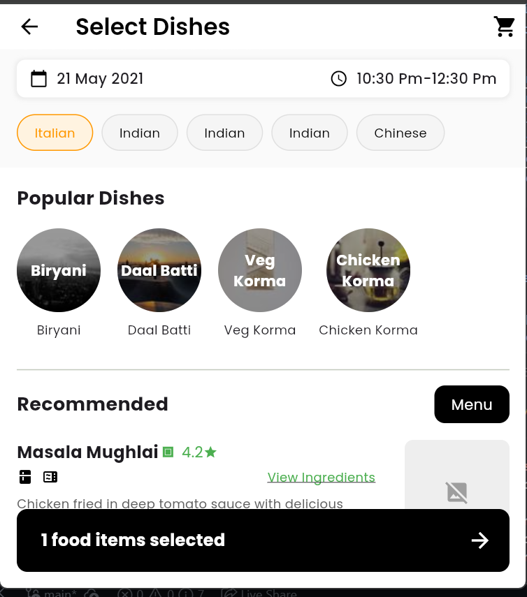
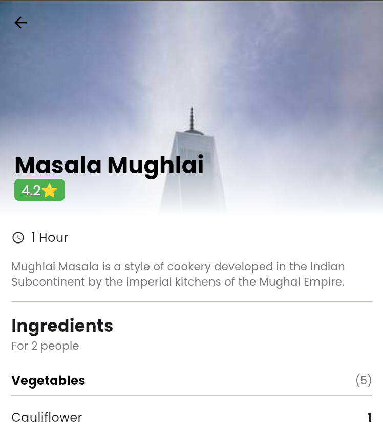

# 🍽️ ChefKart Dishes Selector App

This repository contains the solution for the **ChefKart Flutter Developer Assignment**. It is a responsive mobile application page designed to allow users to select dishes, view popular items, and check detailed ingredient and appliance requirements for specific meals, integrating with a mock API for dynamic data retrieval.

## ✨ Features

* **Two-Screen Navigation:** Implements the **Select Dishes** screen and the **Dish Details** screen.
* **Dynamic Data Fetching:** Fetches dish lists and popular items from a mock Postman API endpoint.
* **UI/UX Fidelity:** The application UI is built to match the provided Adobe XD designs and screenshots closely, using **Poppins** font styling.
* **Dish Selection Logic:** Users can add/remove up to 3 dishes to a floating selection cart.
* **Navigation to Details:** Clicking the floating cart bar navigates to the details page of the first selected dish.
* **Image Handling:** **Recommended Dishes** use the image URL provided by the API, while **Popular Dishes** use random placeholders to demonstrate UI integrity across varied content.
* **List Expansion:** The **Recommended** section uses data duplication to showcase list scrolling functionality, as the API returns only two unique items.

---

## 🛠️ Technology Stack

* **Framework:** Flutter
* **Language:** Dart
* **API Integration:** `http` package
* **Styling:** Custom widgets and `google_fonts` (Poppins) for accurate UI design.

---

***

## 📸 Screenshots

| 1. Select Dishes Screen | 2. Dish Details Screen |
| :---: | :---: |
|  |  |

***

## ⚙️ Project Setup

Follow these steps to clone the repository and run the project locally.


## 📂 Key Files & Structure

The code is organized into standard Flutter directories:
```
chefkart_dishes_app/
├── android/
├── ios/
├── lib/
│   ├── models/
│   │   ├── dish.dart             # Dish, PopularDish models
│   │   └── dish_details.dart     # DishDetails, Ingredient, Appliance models
│   ├── screens/
│   │   ├── select_dishes_screen.dart   # Main screen UI and logic (Screen 1)
│   │   └── dish_details_screen.dart    # Details screen UI and logic (Screen 2)
│   ├── services/
│   │   └── api_service.dart      # Centralized logic for fetching API data
│   └── main.dart                 # Application entry point
├── pubspec.yaml
└── README.md
```

### Prerequisites

* **Flutter SDK:** Installed and configured (version 2.x or later recommended).
* **Dart SDK:** Installed.

### Installation Steps

1.  **Clone the Repository:**

    ```bash
    git clone https://github.com/nxtnilesh/chefkart_project.git
    cd chefkart_project
    ```

2.  **Install Dependencies:**

    The project uses `http` for API calls and `google_fonts` for styling. Ensure these are listed in your `pubspec.yaml`.

    ```bash
    flutter pub get
    ```

3.  **Run the Application:**

    Launch the app on a connected device or simulator.

    ```bash
    flutter run
    ```

---

## 💻 API Endpoints

The application interacts with the following mock API endpoints:

| Feature | Endpoint | Method | Description |
| :--- | :--- | :--- | :--- |
| **All Dishes** | `https://8b648f3c-b624-4ceb-9e7b-8028b7df0ad0.mock.pstmn.io/dishes/v1/` | GET | Fetches the list of popular and recommended dishes for the main screen. |
| **Dish Details** | `https://8b648f3c-b624-4ceb-9e7b-8028b7df0ad0.mock.pstmn.io/dishes/v1/1` | GET | Fetches detailed ingredients and appliances for a specific dish. (Note: Only ID `1` is supported by the mock API.) |

---
